# OpenClaw on AWS EC2 + Discord Bot Workshop

## Overview

In this workshop, you'll deploy **OpenClaw** (formerly MoBot/ClawdBot) on an **AWS EC2 instance** running Ubuntu, connect it to **OpenAI's GPT API**, and integrate it with **Discord**. The bot will run securely in the cloud with no exposed ports, fully controlled through Discord.

**What You'll Build:**
- A cloud-hosted AI agent running on EC2
- Connected to OpenAI's GPT models for intelligence
- Accessible entirely through Discord
- Secure with no inbound HTTP/HTTPS traffic exposed

---

## Prerequisites

Before starting, ensure you have:
- An **AWS account** with permissions to launch EC2 instances
- An **OpenAI account** (create at platform.openai.com)
- A **Discord account** with ability to create a server for testing
- An **SSH client** on your local machine (built-in on Mac/Linux, Windows 10+ has OpenSSH)
- **Terminal/Command Line** familiarity

---

## Part 1: Set Up AWS EC2 Instance

### Step 1.1: Launch EC2 Instance

1. **Go to AWS Console** → https://console.aws.amazon.com
2. **Open EC2 Service** → Click "EC2" in the services menu
3. **Launch Instance** → Click the "Launch instance" button

### Step 1.2: Configure Instance Details
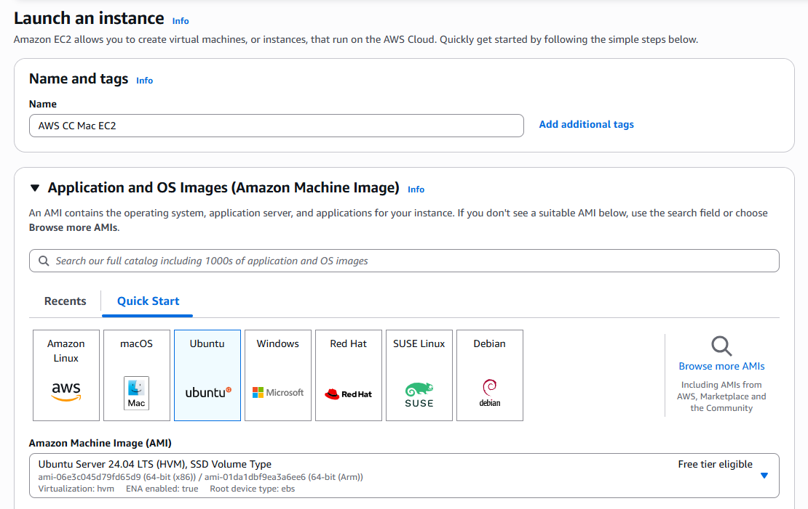

**Name:**
- Enter: `AWS CC Mac EC2` (or your preferred name)

**OS Image (AMI):**
- Select **Ubuntu** (look for "Ubuntu Server 22.04 LTS" or latest stable version)
- This is a free tier eligible option

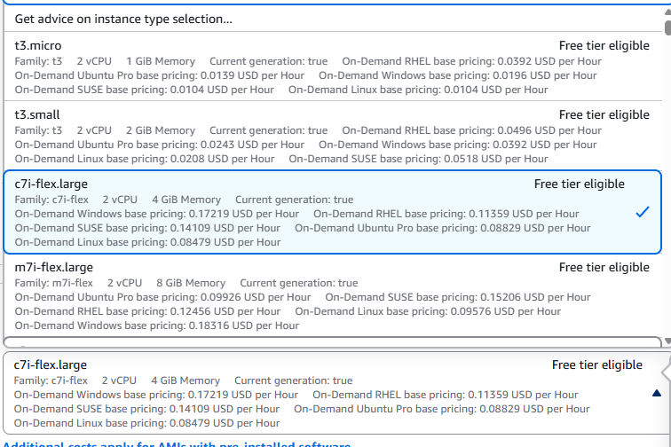

**Instance Type:**
- Select **c7i-flex-large** (has sufficient resources for OpenClaw and GPT processing)
- Note: t2.micro may struggle; anything above is recommended


**Key Pair:**
- Click "Create new key pair"
- Name: `claw-key` (or similar)
- Type: **RSA**
- Format: **.pem** (for Mac/Linux) or **.ppk** (for Windows PuTTY)
- Save this file securely—you'll need it to SSH into your instance
- ⚠️ **Do not share this key file**


### Step 1.3: Configure Network Security

**Network Settings:**
- Allow **SSH traffic** → Change from "Anywhere" to **"My IP"** (this restricts SSH to your current IP)
- **HTTP**: **Check This** (For Web App)
- **HTTPS**:  **Check This** (For Web App)
- OpenClaw will only use **outbound traffic** to reach Discord and OpenAI, and our Web Application will use the HTTP/HTTPS

### Step 1.4: Configure Storage

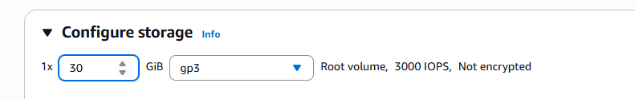

**Storage:**
- Increase default storage to **30 GB** (EBS volume)
- This gives you plenty of space for dependencies and logs

### Step 1.5: Launch

- Click **"Launch instance"** button
- Wait for the instance to reach "Running" state (this takes 1-2 minutes)

---

## Part 2: Connect to Your EC2 Instance via SSH

### Step 2.1: Get Connection Details

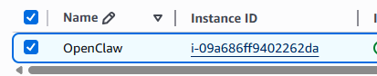

1. **View Instance** → Click on your running instance ID


2. **Connect Button** → Click "Connect" at the top

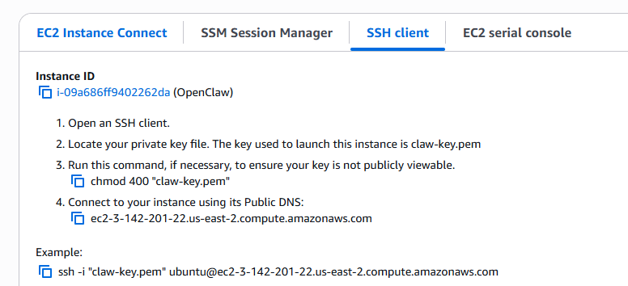

3. **SSH Client Tab** → Select "SSH client"
4. You'll see instructions with your public DNS name

### Step 2.2: Prepare Your Key File (Permission Fix) --- PLEASE FIX THIS TO WORK WITH VSCODE SSH INSTEAD

On your **local machine**, open a terminal and navigate to where you saved the `.pem` key file:

```bash
cd ~/Downloads  # or wherever you saved the key
chmod 400 openclaw-key.pem
```

This restricts the key file permissions so only you can read it (required by SSH).

### Step 2.3: Connect to Your Instance

Copy the SSH command from AWS consoLe & run this command in your terminal:

```bash
ssh -i "openclaw-key.pem" ubuntu@ec2-XX-XXX-XXX-XXX.compute-1.amazonaws.com
```

You'll be asked to confirm the fingerprint:
```
The authenticity of host 'ec2-XX-XXX-XXX-XXX.compute-1.amazonaws.com' can't be established.
Are you sure you want to continue connecting (yes/no)?
```

Type **`yes`** and press Enter.

✅ You're now logged into your EC2 instance as the `ubuntu` user.

---

## Part 3: Install Dependencies on EC2

Once SSH'd into your instance, run these commands in sequence:

### Step 3.1: Update System Packages

```bash
sudo apt update
sudo apt upgrade -y
sudo apt install -y curl
```

This updates your system and installs `curl`, which you'll need to download packages.

### Step 3.2: Install Node.js

```bash
curl -fsSL https://deb.nodesource.com/setup_18.x | sudo -E bash -
sudo apt install -y nodejs
```

### Step 3.3: Install Homebrew

```bash
NONINTERACTIVE=1 CI=1 /bin/bash -c "$(curl -fsSL https://raw.githubusercontent.com/Homebrew/install/HEAD/install.sh)"
```

### Step 3.2: Install AWS CLI

The AWS CLI allows you to interact with AWS services (like S3) from the command line. Install it using your package manager:

```bash
sudo apt install -y awscli
```

Verify the installation:

```bash
aws --version
```

You should see output like: `aws-cli/2.x.x`

**Note:** We'll configure AWS credentials later after setting up your IAM role. The AWS CLI will use an IAM role attached to your EC2 instance for automatic authentication—no manual credential entry needed!

### Step 3.3: Add Homebrew to Your Shell

Add Homebrew to your shell:

```bash
echo 'eval "$(/home/linuxbrew/.linuxbrew/bin/brew shellenv)"' >> ~/.bashrc
eval "$(/home/linuxbrew/.linuxbrew/bin/brew shellenv)"
```

Verify installation:
```bash
node --version
npm --version
brew --version
```

You should see version numbers for all (typically Openclaw requires a node installation > 20)

---

## Part 4: Get Your API Keys

Before installing OpenClaw, you'll need two API keys:

### Step 4.1: OpenAI API Key -- SKIP FOR TODAY

For this workshop, we have provided an API key and sent it on discord for your use. 

These instructions will be for you on your own.

1. Go to **https://platform.openai.com**
2. **Sign in** (or create account)
3. **API keys** section (left sidebar)
4. **Create new secret key** → Name it `mobot-key`
5. **Copy the key immediately** and save it somewhere safe
   - ⚠️ You can only view it once! If lost, you'll need to create a new one

### Step 4.2: Discord Bot Token

1. Go to **https://discord.com/developers/applications**

2. **New Application** → Name it `AWS CC Mac ClawBot`
3. **Bot** section (left sidebar)
4. **Add Bot** button

**Configure Bot Settings:**
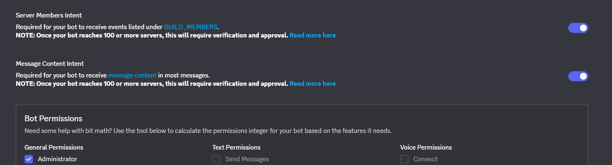
- **Installation** → Set to "None" (don't use Discord's default installer)
- **PUBLIC BOT** → Toggle **OFF** (optional for today but in general you don't want others stealing your tokens)
- **SERVER MEMBERS INTENT** → Toggle **ON** (required for the bot to read messages)
- **MESSAGE CONTENT INTENT** → Toggle **ON** (required for the bot to read messages)
- Click **Save Changes**

**Get Your Token:**
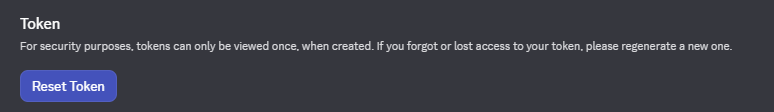

- In the **TOKEN** section, click **Reset Token**
- **Copy** the token immediately
   - ⚠️ This is your only chance to copy it! After you leave, you'll need to reset it again

---

## Part 5: Install and Configure OpenClaw

Back in your **SSH terminal** on the EC2 instance, install OpenClaw using the quick-start command:

```bash
Go to https://openclaw.ai/ and find the installation code for your device
```

e.g.
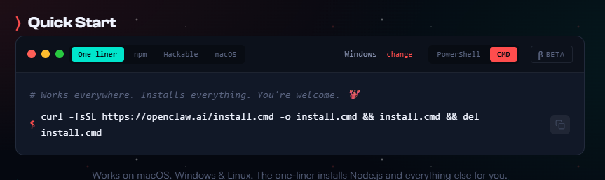

This will launch the OpenClaw installation wizard. **Follow these prompts:**

### Step 5.1: Acknowledge Warnings

When asked about inherent risk:
- Type **`yes`**

### Step 5.2: Quick Start Mode

- Select **`quick start`**

### Step 5.3: Choose AI Provider

When asked about model provider:
- Enter your **OpenAI API key** (from Part 4.1)

### Step 5.4: Select Default Model

Choose your LLM model. Example options:
- **`gpt-4`** (most capable, higher cost)
- **`gpt-4-turbo`** (good balance)
- **`gpt-3.5-turbo`** (fast, lower cost, good for testing)

👉 **Recommendation:** Keep the default, but use **`gpt-3.5-turbo`** for when you want to keep costs low.

### Step 5.5: Select Channel

When asked which channel/platform to use:
- Select **`Discord`**

### Step 5.6: Add Discord Bot Token

- Paste your **Discord bot token** (from Part 4.2)

### Step 5.7: Configure Channel Access

When asked about channel access:
- Select **`open`** (for testing - allows the bot in all channels)

### Step 5.8: Skills Configuration

When asked to configure skills:
- Answer **`no`** (we'll keep it simple for now)

### Step 5.9: Webhooks Configuration

When asked about enabling webhooks:
- **Don't enable** webhooks

### Step 5.10: Complete Setup

The installation might finish with a message to source environment variables:

```bash
source ~/.bashrc
```

Run this to reload your environment.

---
## Part 6: Hatch in TUI to test your LLM connection

Select Hatch in TUI and after it loads try sending it a few messages to confirm that your llm is being communicated with.

---

# Part 2 - Customization | Let's Give OpenClaw Some Tools

OpenClaw can integrate with external services to extend its capabilities. In this part, we'll set up **Amazon S3** as persistent storage for your bot to access meeting summaries, notes, and configurations.

---

## Step 1: Create S3 Bucket

### Step 1.1: Create the Bucket via AWS Console

1. Go to **https://console.aws.amazon.com**
2. Navigate to **S3 service**
3. Click **"Create bucket"**
4. **Bucket name:** `open-claw-memory` (must be globally unique, so add your AWS account ID if needed: `open-claw-memory-XXXXXX`)
5. **Region:** Select the same region as your EC2 instance (e.g., `us-east-1`)
6. **Block Public Access:** Keep all **checked** (for security)
7. Click **"Create bucket"**

✅ Your S3 bucket is created!

### Step 1.2: Create Folders Inside the Bucket

1. **Open your bucket** by clicking on its name
2. Click **"Create folder"** and create these three folders:
   - `meeting_summaries`
   - `notes`
   - `configuration`

✅ Your folder structure is ready!

### Step 1.3: Upload Dummy Files from Repository

Now you'll populate your S3 bucket with the sample files included in the repository. Back in your **EC2 instance SSH terminal**:

**First, check what dummy files are in your local repository:**

```bash
ls -la /path/to/openclaw-test/
```

You should see files like `dummy_class_summary_1.txt` and `dummy_class_summary_2.txt`.

**Upload the dummy files to S3:**

```bash
# Upload dummy summaries to meeting_summaries folder
aws s3 cp dummy_class_summary_1.txt s3://open-claw-memory-XXXXXX/meeting_summaries/
aws s3 cp dummy_class_summary_2.txt s3://open-claw-memory-XXXXXX/meeting_summaries/

# Upload any notes files (create or copy if you have them)
# aws s3 cp your-notes.txt s3://open-claw-memory-XXXXXX/notes/

# Upload configuration files
# aws s3 cp config.json s3://open-claw-memory-XXXXXX/configuration/
```

**Replace `open-claw-memory-XXXXXX` with your actual bucket name.**

**Alternative: Upload entire directory at once**

If you have directories locally, upload them all:

```bash
aws s3 sync /path/to/local/meeting_summaries s3://open-claw-memory-XXXXXX/meeting_summaries/
aws s3 sync /path/to/local/notes s3://open-claw-memory-XXXXXX/notes/
aws s3 sync /path/to/local/configuration s3://open-claw-memory-XXXXXX/configuration/
```

Verify uploads:

```bash
aws s3api list-objects-v2 --bucket open-claw-memory-XXXXXX --prefix meeting_summaries/
aws s3api list-objects-v2 --bucket open-claw-memory-XXXXXX --prefix notes/
aws s3api list-objects-v2 --bucket open-claw-memory-XXXXXX --prefix configuration/
```

✅ Files are now in S3!

---

## Step 2: Create IAM Role for EC2-to-S3 Connection

Your EC2 instance needs permission to access S3. You'll create an **IAM Role** and attach it to your instance.

### Step 2.1: Create IAM Role

1. Go to **AWS Console** → **IAM** service
2. Left sidebar → **Roles**
3. Click **"Create role"**
4. **Trusted entity type:** Select **"AWS service"**
5. **Use case:** Select **"EC2"**
6. Click **"Next"**

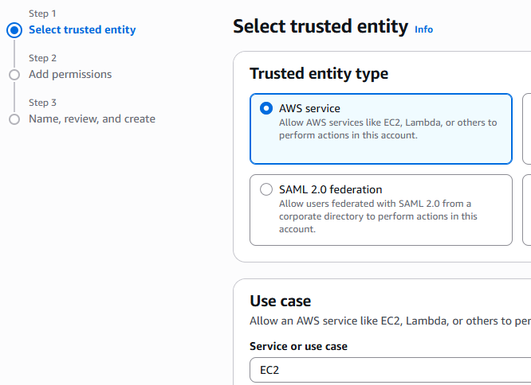

### Step 2.2: Add Permissions

1. Search for **"AmazonS3FullAccess"** policy
2. ✅ Check the box next to it
3. Click **"Next"**

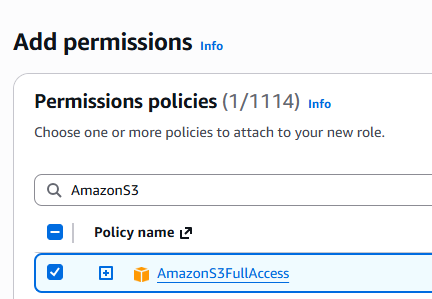

### Step 2.3: Name the Role

1. **Role name:** `S3ConnectionRole`
2. **Description:** "Allows EC2 instance to access S3 bucket for OpenClaw"
3. Click **"Create role"**


✅ Role created!

---

## Step 3: Attach IAM Role to Your EC2 Instance

### Step 3.1: Attach Role to Instance

1. Go to **EC2 Dashboard** → **Instances**
2. **Select your OpenClaw instance**
3. Click **"Actions"** → **"Security"** → **"Modify IAM role"**
4. Select **"S3ConnectionRole"** from the dropdown
5. Click **"Update IAM role"**


✅ Role is now attached to your instance!

### Step 3.2: Restart EC2 Instance (Important!)

For the role to take effect, **restart your instance**:

1. Select your instance → **Instance State** → **Reboot instance**
2. Wait ~1 minute for it to restart
3. SSH back in once it's running

---

## Step 4: Test EC2 Connection to S3 Bucket

### Step 4.1: Test AWS CLI Credentials

Back in your **SSH terminal**, test that your instance can access S3:

```bash
aws sts get-caller-identity
```

You should see output like:
```json
{
    "UserId": "AIDAI...",
    "Account": "123456789012",
    "Arn": "arn:aws:iam::123456789012:role/S3ConnectionRole"
}
```

✅ If you see your role name (`S3ConnectionRole`), authentication is working!

### Step 4.2: Test S3 Bucket Access

```bash
# List objects in your bucket
aws s3 ls s3://open-claw-memory-XXXXXX/

# List objects in a specific folder
aws s3 ls s3://open-claw-memory-XXXXXX/meeting_summaries/
```

You should see your uploaded files listed.

### Step 4.3: Test File Download

```bash
# Download a file from S3 to your EC2 instance
aws s3 cp s3://open-claw-memory-XXXXXX/meeting_summaries/dummy_class_summary_1.txt /tmp/test-download.txt

# Verify it downloaded
cat /tmp/test-download.txt
```

✅ If you see the file contents, your EC2-to-S3 connection is fully working!

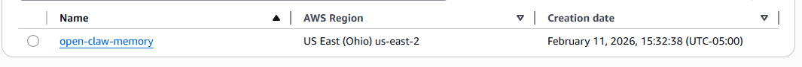

---

## Step 5: Configure OpenClaw + Discord Bot to Use S3

Now configure OpenClaw to access these S3 files as tools/memory:

### Step 5.1: Add Command Config to OpenClaw

Edit the OpenClaw configuration file:

```bash
nano ~/.openclaw/openclaw.json
```

We're going to add some capabilities to OpenClaw as well as the discord bot.


Within "commands" (add it to the json if it doesnt exist) you'll want to add the following entry:

```json
...
  "commands": {
    "text": true,
    "native": "auto",
    "nativeSkills": "auto",
    "useAccessGroups": false
  },
...
```

Within "channels"
You'll want to add the follow "commands" property to the existing "channels" key in the openclaw.json file. Go in and copy paste that in your shell nano editor.


```json
  "channels": {
    "discord": {
      "enabled": true,
      "token": "YOUR KEY",
      "groupPolicy": "open",
----add these
      "commands": {
        "native" : true,
        "nativeSkills" : true
      },

      "dm": {
        "enabled": true,
        "policy": "open",
        "allowFrom": [
          "*"
        ]
      }
-----
    }
  }
```

### Step 5.2: Create a new Skill for OpenClaw

OpenClaw Skills are custom tools that extend the bot's capabilities. We'll create a skill that allows your bot to read files from your S3 bucket, enabling it to answer questions about meeting summaries and stored documents.

**Step 5.2.1: Create Skill Directory**

SSH into your instance and create the skill directory:

```bash
mkdir -p ~/.openclaw/workspace/skills/s3_file_text
```

**Step 5.2.2: Create the Skill File**

Create and edit the skill markdown file:

```bash
nano ~/.openclaw/workspace/skills/s3_file_text/skill.md
```

Copy and paste the following enhanced skill definition:

```markdown
---
name: s3_file_text
description: Intelligent S3 file retriever for meeting summaries, notes, and documents from the open-claw-memory bucket
command: s3_file_text
---

## Overview
Read and retrieve text content from files stored in the open-claw-memory S3 bucket. This skill enables your bot to access meeting summaries, notes, and configuration files to provide contextual, informed responses.

## Capabilities
- **Latest Content Resolution**: Automatically find and retrieve the most recently updated file in any folder
- **Intelligent Summarization**: For large files, provide the most relevant excerpts
- **Smart Caching**: Reference previously accessed documents in conversation

## Allowed Parameters

**Max File Size**: 500 KB (approximately 125,000 tokens)

**Supported Folders**:
- `meeting_summaries/` - Class notes, meeting transcripts, lecture summaries
- `notes/` - Personal notes, research documents, quick references
- `configuration/` - System configs, instructions, templates

**Input Formats**:
- `s3://open-claw-memory/meeting_summaries/filename.txt`
- `latest meeting summary` - Automatically resolves to newest file in meeting_summaries/
- `notes on [topic]` - Searches and returns relevant notes
- `show me config` - Returns configuration file contents to give you more context

## Execution Instructions

### For Specific Files:
1. Use `aws s3api head-object --bucket open-claw-memory --key <filepath>` to get file metadata2
2. Download: `aws s3 cp s3://open-claw-memory/<filepath> -`
3. Return full content if < 50KB, otherwise summarize key sections

### For "Latest" Queries:
1. Run: `aws s3api list-objects-v2 --bucket open-claw-memory --prefix meeting_summaries/ --query 'Contents[].{Key:Key,Modified:LastModified}' --output json`
2. Sort by LastModified date (newest first)
3. Download the most recent file
4. Return with metadata: "(Latest from [date])"

### Error Handling:
- If file not found: "I couldn't find that file. Would you like me to list available documents?"
- If bucket empty: "Your S3 bucket appears empty. Upload files to start using this feature."
- If access denied: "I don't have permission to access that bucket. Check IAM role configuration."

## Response Format
When retrieving files, provide:
1. **Source**: Filename and folder
2. **Date**: Last modified timestamp
3. **Content**: Full text or key excerpts
4. **Analysis**: Brief take-away or summary if requested

## Security Notes
- Always use IAM role credentials (already configured on your EC2 instance)
- Validate all S3 paths before execution
- Log all file access attempts

## Example Prompts Users Can Try
- "What was discussed in the latest meeting summary?"
- "Show me my notes on AWS and EC2"
- "Can you pull the configuration file and explain it?"
- "Summarize all meeting summaries from the past week"
```

**Save the file** (Ctrl+O, Enter, then Ctrl+X)

**Step 5.2.3: Restart OpenClaw Gateway**

Apply your changes by restarting the OpenClaw gateway:

```bash
npx openclaw gateway restart
```

You should see output confirming the gateway has restarted. The new skill is now available to your bot!

**Verify the skill loaded:**

```bash
ls -la ~/.openclaw/workspace/skills/
```

You should see `s3_file_text` listed.

✅ Your S3 file skill is ready to use!

---

### Step 5.3: Invite Discord Bot to Your Server

Now that your OpenClaw instance has voice commands enabled, you need to invite your Discord bot to your server. The bot will now be able to respond to commands and use the S3 skill you just created.

**Step 5.3.1: Generate OAuth2 Installation URL**

1. Go to **https://discord.com/developers/applications**
2. Select your **AWS CC Mac ClawBot** application
3. **OAuth2** section (left sidebar)
4. **URL Generator** subsection

**Select Scopes:**

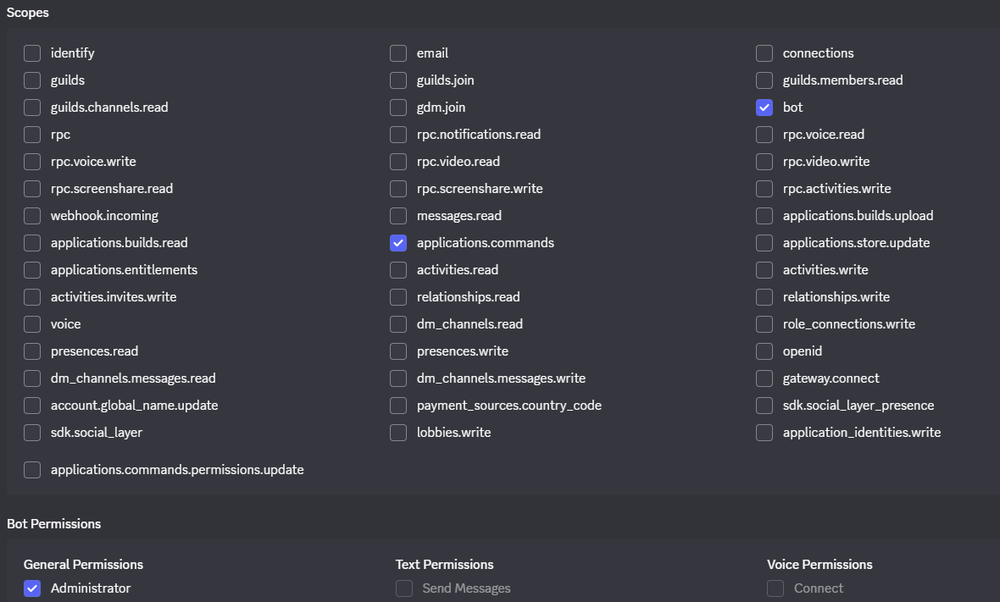

- ✅ `bot`
- ✅ `applications.commands`

**Select Permissions:**
- ✅ `Administrator` (allows full access to channels and message management)

**Copy the generated URL** at the bottom of the page.

**Step 5.3.2: Install Bot to Your Discord Server**

1. **Open the copied OAuth2 URL in a new browser tab**
2. **Select your Discord server** from the dropdown (the one you want to test with)
3. Click **"Authorize"**
4. Complete any CAPTCHA if prompted
5. Grant the permissions

✅ **Your bot is now in your Discord server!**

You should see a welcome message in one of your server channels confirming the bot has joined.

---

### Step 6: Test Through Discord

In Discord, try asking your bot to access information from S3:

```
@AWS CC Mac ClawBot Can you summarize the meeting notes from my S3 bucket?
```

or

```
@AWS CC Mac ClawBot What's in my configuration folder?
```

✅ Your OpenClaw bot can now access S3!


## Troubleshooting Guide

| Issue | Cause | Solution |
|-------|-------|----------|
| **Can't SSH into instance** | SSH not enabled or IP changed | Check security group; restart instance if IP changed |
| **Installation fails** | Missing Node.js or curl | Verify `node -v` and `npm -v` both work |
| **OpenAI API key rejected** | Invalid key format or key already used quota | Verify key at platform.openai.com; check usage |
| **Discord bot doesn't respond** | Token invalid or bot not invited | Regenerate token; check bot is in server |
| **Can't access web UI at localhost:18789** | Port forward not active | Ensure SSH port forward terminal is still running |
| **Bot is offline in Discord** | OpenClaw process crashed | SSH into instance; check process: `ps aux \| grep openclaw` |
| **Permission denied (publickey)** | Wrong key permissions | Run `chmod 400 openclaw-key.pem` |

---

## Costs & Notes

**AWS Costs:** CANCEL AFTER WORKSHOP IF NOT NEEDED
- **EC2 Instance:** check website
- **30 GB storage:** ~$3/month
- **Free tier:** First 12 months get significant free tier credits

**OpenAI Costs:**
- **GPT-3.5-turbo:** Very cheap (~$0.0005 per request)
- **GPT-4:** More expensive (~$0.03 per request)
- Set usage limits in OpenAI dashboard to avoid surprises

**Security Reminders:**
- ✅ SSH key restricted to your IP
- ✅ Discord bot token kept private
- ✅ OpenAI key never exposed to clients

---

## Next Steps Beyond Workshop

Once your bot is working, you can:

1. **Add Custom Skills** — Extend OpenClaw with custom commands or functions
2. **Deploy Multiple Instances** — Run bots for different communities/purposes
3. **Create Workflows** — Build autonomous tasks triggered by Discord messages
4. **Monitor & Scale** — Use CloudWatch for monitoring; upgrade to larger instance if needed
5. **Set Budget Alerts** — On AWS to prevent unexpected bills

---

## Resources

- **OpenClaw Docs:** https://docs.openclaw.io
- **AWS EC2 Documentation:** https://docs.aws.amazon.com/ec2/
- **OpenAI API Docs:** https://platform.openai.com/docs
- **Discord Developer Portal:** https://discord.com/developers/applications
- **SSH Guide:** https://docs.aws.amazon.com/AWSEC2/latest/UserGuide/ec2-key-pairs.html

---

## Support

If you run into issues:
1. Check the **Troubleshooting Guide** above
2. Review the output logs from OpenClaw installation
3. Verify all API keys are correctly entered
4. Check that your EC2 security group allows SSH from your IP

Good luck! 🚀
